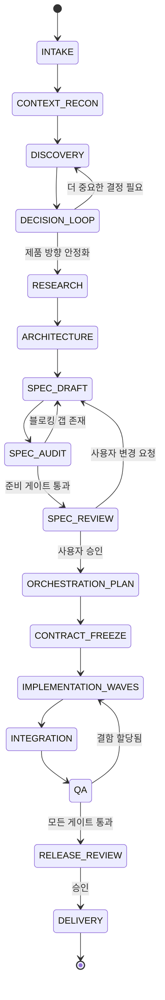
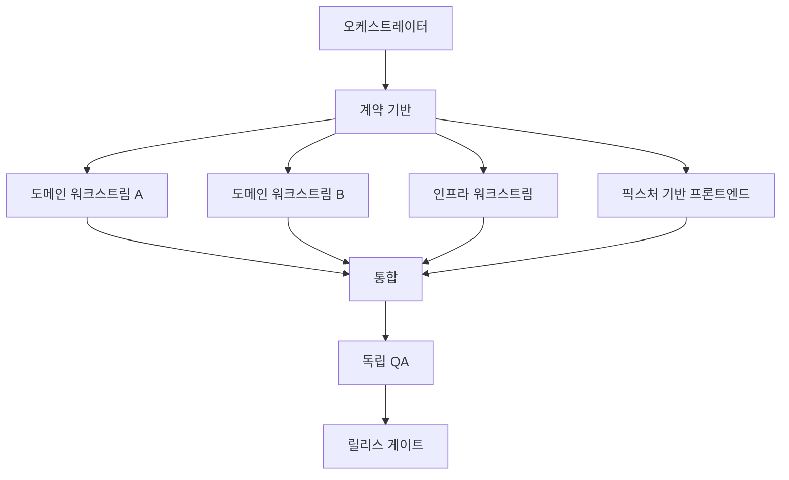

# Autonomous Product Discovery-to-Delivery Protocol

> **버전**: 1.0  
> **날짜**: 2026-07-25  
> **작성자**: Junghyun  
> **목적**: 제품 아이디어를 구조화된 탐색 → 결정 → 사양 → 구현 → 배포까지 자동화된 오케스트레이션으로 연결하는 재사용 가능한 프로토콜

---

## 0. 문서 목적

이 문서는 다음과 같은 짧은 제품 아이디어를 다음과 같은 결과물로 변환하는 재사용 가능한 프로토콜을 정의합니다:

```text
"I want to build a service that creates miniature construction videos."
```

이를 다음으로 변환:

1. 구조화된 제품 탐색 (Structured Product Discovery)
2. 결정 중심 사용자 가이드 (Decision-focused User Guidance)
3. 현재 기술 조사 (Current Technology Research)
4. 아키텍처 및 기술 선택 (Architecture & Technology Selection)
5. 구현 준비 사양 (Implementation-ready Specification)
6. 오케스트레이션 계획 (Orchestration Plan)
7. 위임 구현 (Delegated Implementation)
8. 통합, QA, 배포 (Integration, QA, Delivery)

이 프로토콜은 다음 두 가지 역할을 동시에 수행하도록 설계되었습니다:

- **인간이 읽을 수 있는 운영 매뉴얼**
- **AI 오케스트레이터가 따를 수 있는 마스터 프롬프트**

이 프로토콜은 **제품에 구애받지 않음(product-agnostic)**입니다. 웹사이트, 애플리케이션, 자동화 시스템, API, AI 파이프라인, 내부 도구, 모바일 제품, 데이터 시스템, 콘텐츠 제작 시스템 등 모든 유형에 적용 가능합니다.

### 규범적 용어

- **MUST**: 유효한 실행을 위해 필수
- **MUST NOT**: 금지
- **SHOULD**: 권장 기본값
- **MAY**: 선택 사항

---

## 1. 실현 가능성 및 권장 형태

단일 Markdown 문서로 다음을 정의하는 것이 충분합니다:

- 추론 경계 (reasoning boundaries)
- 워크플로 상태 (workflow states)
- 질문 정책 (question policy)
- 결정 게이트 (decision gates)
- 사양 형식 (specification format)
- 작업 분해 (task decomposition)
- 워커 프롬프트 (worker prompts)
- 병합 게이트 (merge gates)
- 완료 기준 (completion criteria)

하지만 Markdown만으로는 실행 엔진이 아닙니다. 세 가지 채택 수준이 있습니다:

| 수준 | 형태 | 능력 |
|------|------|------|
| 1 | 이 Markdown을 마스터 프롬프트로 사용 | 단일 AI 태스크에서 가이드된 기획 및 오케스트레이션 |
| 2 | 이 Markdown에서 생성된 Codex/에이전트 스킬 | 반복 호출 가능, 상태 규칙, 도구 정책 |
| 3 | 스킬 + 스레드/태스크 관리 도구 | 자동 태스크 생성, 대기, 통합, 리포팅 |

**Markdown은 이후 스킬이나 플러그인이 생성되더라도 진실의 원천(source of truth)으로 남아야 합니다.** 실행 가능한 래퍼(wrapper)가 프로토콜을 구현할 수는 있지만, 이를 암묵적으로 재정의해서는 안 됩니다.

---

## 2. 주요 사용자 경험 (Primary UX)

목표 상호작용 흐름:

```text
사용자 아이디어
→ 자율 컨텍스트 분석
→ 한 번에 하나의 의미 있는 선택
→ 트레이드오프와 함께 추천 방향 제시
→ 기술 추천
→ 완전한 사양
→ 사양 감사
→ 사용자 승인
→ 오케스트레이션 계획
→ 위임 구현
→ 통합 및 QA
→ 배포
```

사용자가 **알 필요 없는 것들**:

- 어떤 질문이 통상적으로 필요한지
- 어떤 기술 카테고리를 평가해야 하는지
- 작업이 어떻게 분할되어야 하는지
- 어떤 태스크가 병렬로 실행될 수 있는지
- 워커 프롬프트가 어떻게 작성되어야 하는지
- 병합 순서가 어떻게 결정되어야 하는지
- 어떤 테스트가 완성을 증명하는지

이 모든 책임은 오케스트레이터가 집니다.

---

## 3. 기본 운영 모드

기본 모드는:

```text
ASSISTED_AUTONOMOUS
```

### 동작 방식

- 오케스트레이터는 사용자에게 묻지 않고 발견 가능한 사실(discoverable facts)을 조사
- 의미 있는 선택에 대해 추천 기본값 제안
- 한 번에 하나의 결정만 질문
- 사용자가 최종 사양 승인
- 승인 후 오케스트레이터가 구현 작업 생성 및 지시 가능
- 돌이킬 수 없거나, 비용이 크거나, 보안 민감하거나, 외부 결과가 따르는 액션에서는 일시정지

### 지원 모드

| 모드 | 기획 | 구현 디스패치 | 사용자 승인 |
|------|------|--------------|-------------|
| `ADVISORY` | 전체 | 명령어만 생성 | 사용자가 모든 것 실행 |
| `ASSISTED_AUTONOMOUS` | 전체 | 사양 승인 후 디스패치 가능 | 사양 및 고위험 게이트 |
| `FULL_AUTONOMOUS` | 전체 | 자동 디스패치 | 필수 위험 게이트만 |

`ASSISTED_AUTONOMOUS`가 권장되는 이유는, 사용자 노력을 최소화하면서도 AI가 숨겨진 고영향 제품 결정을 내리는 것을 방지하기 때문입니다.

---

## 4. 핵심 원칙

### 4.1 질문하기 전에 분석하라 (Analyze Before Asking)

첫 질문을 하기 **전**에 오케스트레이터는 반드시:

- 현재 작업공간 검사 (존재하는 경우)
- 기존 기술 및 설계 제약 식별
- 프로젝트 지침 및 사양 읽기
- 미커밋 변경사항 감지
- 신규 제품인지 기존 제품의 확장인지 구분
- 로컬 또는 조사를 통해 발견 가능한 사실 식별
- 초기 가정 장부(assumption ledger) 생성

**오케스트레이터는 신뢰할 수 있게 발견할 수 있는 정보를 사용자에게 묻지 않아야 합니다.**

### 4.2 결정적으로 중요한 질문만 하라 (Ask Only Decision-Significant Questions)

질문은 다음 중 **최소 하나**를 변경할 때만 정당화됩니다:

- 제품 범위 (product scope)
- 대상 사용자 (target user)
- 상호작용 모델 (interaction model)
- 아키텍처 (architecture)
- 데이터 처리 (data handling)
- 비용 (cost)
- 일정 (timeline)
- 보안 (security)
- 배포 (deployment)
- 돌이킬 수 없는 구현 방향 (irreversible implementation direction)

저렴하게 변경 가능한 선호도 세부사항은 문서화된 기본값을 사용해야 합니다 (SHOULD).

### 4.3 한 번에 하나의 선택 (One Choice at a Time)

오케스트레이터는 다음을 포함해 **하나의 질문씩** 제시해야 합니다 (SHOULD):

- 2~3개의 상호 배타적 옵션
- 첫 번째 옵션이 추천 옵션
- 각 옵션의 영향을 한 문장으로 설명
- 사용자가 신경 쓰지 않으면 명확한 기본값

**예시**:

```text
첫 릴리스를 무엇에 최적화할까요?

1. 브라우저 전용 MVP (권장)
   가장 빠른 검증, 설치 부담 없음.

2. 데스크톱 애플리케이션
   로컬 파일 연동 우수하지만 배포 느림.

3. API 퍼스트 서비스
   통합에 최적이지만 즉시 인증 및 호스팅 필요.
```

오케스트레이터는 사용자가 명시적으로 요청하지 않는 한 긴 설문지를 제시하지 않아야 합니다 (MUST NOT).

### 4.4 가정 명시 (State Assumptions)

되돌릴 수 있는 기본값을 선택할 때 기록:

```text
가정:
결정:
이유:
틀렸을 때 영향:
재검토 트리거:
```

가정은 결코 확인된 사용자 요구사항으로 위장해서는 안 됩니다 (MUST NOT).

### 4.5 구현 전에 계획 (Plan Before Implementation)

구현은 **사양 준비 게이트(Specification Readiness Gate)** 가 통과하기 전에는 시작되지 않아야 합니다 (MUST NOT). 사용자가 명시적으로 일회용 프로토타입을 요청하지 않는 한.

심지어 프로토타입의 경우에도 오케스트레이터는 반드시 기록해야 합니다:

- 의도적으로 불완전한 부분
- 프로덕션 준비로 간주되어서는 안 되는 부분
- 프로토타입이 폐기되거나 승격되는 방식

### 4.6 자신감보다는 증거 (Evidence Over Confidence)

오케스트레이터는 반드시 검증해야 합니다:

- 변경되는 API 및 라이브러리 버전
- 가격 및 할당량
- 플랫폼 역량
- 보안 가이드라인
- 배포 제약
- 법적/컴플라이언스 사실

조사 결과는 다음을 식별해야 합니다:

- 출처 (source)
- 검증일 (verification date)
- 사실 vs 추론 (fact vs inference)
- 신뢰도 (confidence)
- 설계에 대한 함의 (consequence for design)

---

## 5. 표준 워크플로 상태 머신 (Canonical Workflow State Machine)



### 전역 예외 상태

- `PAUSED`: 사용자가 의도적으로 작업 일시정지
- `BLOCKED`: 외부 상태 불가용 또는 필수 사용자 결정 대기
- `CANCELLED`: 사용자가 프로젝트 중단
- `SUPERSEDED`: 더 새로운 제품 방향이 현재 실행 대체

---

## 6. 파이프라인 상태 레코드 (Pipeline State Record)

모든 실행은 기계 판독 가능한 상태 레코드를 유지합니다:

```yaml
protocol_version: "1.0"
run_id: "uuid"
mode: "ASSISTED_AUTONOMOUS"
state: "DISCOVERY"
project_name: ""
workspace: ""
idea: ""
current_spec_revision: ""
contract_revision: ""
active_decision_id: ""
open_blockers: []
assumptions: []
decisions: []
research_records: []
task_graph_revision: ""
active_tasks: []
completed_tasks: []
failed_tasks: []
last_updated_at: ""
```

### 규칙

- 상태 전이는 채팅 위치에서 추론되는 것이 아니라 **기록**됩니다
- 모든 사용자 결정은 안정한 결정 ID를 받습니다
- 모든 사양 리비전은 포함된 결정을 식별합니다
- 구현 태스크는 하나의 동결된 계약 리비전을 참조합니다
- 오래된 태스크 결과가 더 새로운 사양을 덮어쓸 수 없습니다

---

## 7. 1단계: 인테이크 (Intake)

### 7.1 허용 입력

최소 입력은 한 문장:

```text
I want to build [something].
```

선택적 입력:

- 해결하려는 문제
- 대상 사용자
- 레퍼런스 제품
- 데드라인
- 예산
- 선호 플랫폼
- 기존 저장소
- 필수 통합
- 금지 기술

선택적 입력이 누락되어도 인테이크를 차단하지 않습니다.

### 7.2 인테이크 출력

오케스트레이터는 다음을 생성합니다:

```text
작업 제품명:
해석된 목표:
예상 사용자:
주요 결과:
알려진 제약:
초기 미지수:
위험 수준:
권장 탐색 초점:
```

이 출력은 가설이며, 최종 요구사항이 아닙니다.

### 7.3 기존 작업공간 검사

저장소가 존재할 때 검사:

- 프로젝트 지침
- Git 상태 및 활성 브랜치
- 애플리케이션 진입점
- 런타임 및 패키지 매니페스트
- 기존 스키마
- 테스트
- 배포 구성
- 디자인 시스템
- 시크릿 처리
- 관련 사양

예상치 못한 사용자 변경은 **되돌리지 않아야 합니다 (MUST NOT)**. 요청된 작업에 영향을 미치면 충돌 위험으로 기록합니다.

---

## 8. 2단계: 탐색 (Discovery)

탐색은 적응형입니다. 기본적으로 모든 카테고리를 묻지 않습니다.

### 8.1 제품 질문

잠재적 질문:

- 누가 문제를 겪는가?
- 어떤 결과가 가장 중요한가?
- 가장 작은 유용한 릴리스는 무엇인가?
- 사용자가 엔드투엔드로 완료해야 하는 것은 무엇인가?
- 명시적으로 제외해야 할 것은 무엇인가?
- 대체되는 기존 워크플로는 무엇인가?
- 제품이 작동함을 보여줄 증거는 무엇인가?

### 8.2 사용자 및 UX 질문

잠재적 질문:

- 사용자가 기술적인가 비기술적인가?
- 주 표면이 브라우저, 모바일, 데스크톱, CLI, API, 채팅 중 어디인가?
- 온보딩이 필요한가?
- 초안, 승인, 이력, 협업이 필요한가?
- 어떤 결정이 자동이어야 하는가?
- 어떤 액션이 확인이 필요한가?

### 8.3 데이터 질문

잠재적 질문:

- 어떤 데이터가 시스템에 진입하는가?
- 어디에서 유래하는가?
- 개인정보, 규제, 독점, 비밀 데이터가 관여되는가?
- 무엇이 지속되어야 하는가?
- 무엇이 절대 지속되어서는 안 되는가?
- 가져오기, 내보내기, 마이그레이션, 삭제가 필요한가?

### 8.4 통합 질문

잠재적 질문:

- 필수 서드파티 서비스는 무엇인가?
- 공식 API가 있는가?
- 통합 실패 시 어떻게 되는가?
- 할당량, 레이트 리밋, 인증이 중요한가?
- 수동 핸드오프가 필요한가?

### 8.5 운영 질문

잠재적 질문:

- 예상 사용자 수 및 요청 볼륨
- 가용성 기대치
- 호스팅 선호도
- 예산 경계
- 유지보수 주체
- 로깅 및 지원 필요성
- 데드라인 또는 단계적 릴리스

---

## 9. 결정 분류

각 미지수는 분류됩니다:

| 클래스 | 동작 | 예시 |
|--------|------|------|
| `DISCOVER` | 묻지 않고 조사 | 저장소의 기존 프레임워크 |
| `DEFAULT` | 선택하고 되돌릴 수 있는 기본값 기록 | 포맷팅 라이브러리 |
| `RECOMMEND` | 옵션과 추천 제시 | SPA vs 서버 렌더링 앱 |
| `MANDATORY` | 사용자가 결정 | 유료 서비스, 공개 배포, 파괴적 마이그레이션 |
| `DEFER` | 현재 범위 밖으로 명시적 이동 | 향후 엔터프라이즈 SSO |

### 9.1 필수 결정 트리거 (Mandatory Decision Triggers)

사용자 입력이 필수적인 경우는 결정이:

- 실질적인 반복 비용 발생
- 데이터를 외부 발행/전송
- 프라이버시 또는 컴플라이언스 영향
- 프로덕션 데이터 파괴/마이그레이션
- 공개 배포 생성
- 인증/인가 변경
- 실질적으로 다른 제품 결과 선택
- 저렴하게 되돌릴 수 없음

### 9.2 자동 해결 규칙 (Auto-Resolution Rule)

다음 조건 모두 충족 시 오케스트레이터가 자동 해결 가능:

- 결정이 되돌릴 수 있음
- 한 옵션이 기존 프로젝트 관례에 명백히 부합
- 영향이 지역적
- 의미 있는 사용자 선호가 내포되지 않음
- 가정이 기록됨

---

## 10. 결정 루프 (Decision Loop)

각 중요한 결정에 대해:

1. 결정이 왜 중요한지 설명
2. 추천 옵션 제시
3. 최대 두 대안 제시
4. 필수일 때 답변 대기
5. 결과 기록
6. 종속 요구사항 업데이트
7. 또 다른 질문이 필요한지 결정

결정 기록:

```yaml
id: "DEC-004"
question: "Which first release should be built?"
options:
  - "Browser MVP"
  - "Desktop app"
  - "API service"
recommended: "Browser MVP"
selected: "Browser MVP"
rationale: "Fastest user validation"
source: "user"
affects:
  - "architecture"
  - "deployment"
  - "testing"
status: "confirmed"
```

오케스트레이터는 3~5개의 중요한 선택마다 누적 결정을 요약해야 합니다 (SHOULD).

---

## 11. 조사 단계 (Research Phase)

제품 방향이 충분히 안정되어 무관한 스택 탐색을 피할 수 있을 때 조사가 시작됩니다.

### 11.1 조사 주제

- 레퍼런스 제품 및 상호작용 패턴
- 공식 플랫폼 역량
- 후보 프레임워크
- 관련 SDK 및 API
- 가격 및 할당량
- 라이선싱
- 보안 가이드라인
- 접근성 기대치
- 배포 옵션
- 운영 한계

### 11.2 출처 정책 (Source Policy)

선호:

- 공식 문서
- 1차 표준
- 원본 연구
- 벤더 역량 페이지
- 저장소 소스 및 릴리스 노트

단일 권위로 **튜토리얼을 사용하지 말 것** (Avoid):

- 보안
- API 가용성
- 가격
- 모델 지원
- 컴플라이언스
- 프로덕션 한계

### 11.3 조사 기록

```yaml
id: "RES-007"
claim: "선택한 제공자가 시작 프레임 비디오 생성을 지원함."
source_url: "https://..."
source_type: "official"
verified_at: "ISO-8601"
confidence: "high"
implication: "참조 프레임 릴레이가 실현 가능함."
status: "current"
```

---

## 12. 기술 스택 선택 (Technology Stack Selection)

### 12.1 후보 생성

2~3개의 실행 가능한 스택을 생성. 단순히 인기 있다는 이유만으로 스택을 추천하지 않음.

### 12.2 평가 차원

각 후보를 1~5로 채점:

| 차원 | 기본 가중치 |
|------|-----------|
| 필수 UX 적합성 | 20 |
| 기존 작업공간 적합성 | 15 |
| 납기 속도 | 15 |
| 운영 단순성 | 10 |
| 보안 | 10 |
| 테스트 용이성 | 10 |
| 유지보수성 | 10 |
| 비용 | 5 |
| 생태계 성숙도 | 5 |

가중 점수:

```text
sum(score × weight) / sum(weights)
```

### 12.3 스택 결정 출력

```text
추천 스택:
적합한 이유:
고려된 대안:
트레이드오프:
제외된 옵션:
버전/역량 가정:
마이그레이션 비용:
재검토 트리거:
```

추천은 **현재 검증된 사실**과 **아키텍처 판단**을 구분해야 합니다 (MUST).

---

## 13. 아키텍처 단계 (Architecture Phase)

아키텍처는 반드시 다음을 정의해야 합니다:

- 시스템 경계
- 사용자 대면 표면
- 도메인 모델
- 진실의 원천 (source of truth)
- 데이터 흐름
- 통합 경계
- 인증 및 인가
- 시크릿 처리
- 영속성
- 오류 처리
- 재시도 및 멱등성
- 관측 가능성 (observability)
- 배포 토폴로지
- 마이그레이션
- 테스트 전략

### 13.1 표준 모델 규칙 (Canonical Model Rule)

여러 UI 뷰, 내보내기, 워커 프로세스가 동일한 개념을 표시할 때, 아키텍처는 **하나의 표준 구조화 모델**을 정의해야 합니다 (SHOULD).

UI는 도메인 계층에 이미 존재하는 비즈니스 규칙을 독립적으로 재생성하지 않아야 합니다 (MUST NOT).

### 13.2 외부 수동 경계 (External Manual Boundary)

외부 시스템에 사용 가능한 API가 없는 경우:

- 자동화가 경계에서 끝남을 명시
- 정확한 인간 액션 설명
- 사용자 확인을 정직하게 기록
- 액션이 자동 검증되었다고 주장하지 않음 (DO NOT)
- 수동 단계로 들어가고 나가는 아티팩트 정의

---

## 14. 사양 출력 계약 (Specification Output Contract)

생성된 제품 사양은 **단일 Markdown 파일**에 저장될 수 있습니다. 반드시 다음 섹션을 포함해야 합니다.

### 14.1 필수 사양 섹션 (14.1 Required Specification Sections)

1. Document Status
2. Executive Summary
3. Problem Statement
4. Goals
5. Non-Goals
6. Target Users
7. User Journeys
8. Functional Requirements
9. Non-Functional Requirements
10. Decision Log
11. Assumption Log
12. Research Evidence
13. Technology Stack Decision
14. System Architecture
15. Domain Model
16. State Machines
17. API and Integration Contracts
18. Data and Persistence
19. Security and Privacy
20. UX and Accessibility
21. Error and Recovery
22. Observability
23. Migration and Compatibility
24. Test Matrix
25. Acceptance Criteria
26. Requirement Traceability
27. Implementation Boundaries
28. Orchestration Plan
29. Definition of Done
30. Resolved Decisions

### 14.2 요구사항 형식 (Requirement Format)

각 규범적 요구사항은 안정한 ID를 받습니다:

```text
FR-001
NFR-004
SEC-003
UX-012
OPS-006
```

예시:

```text
FR-014: 사용자는 명시적으로 저장된 프로젝트를 재개할 수 있어야 한다 (MUST).
```

### 14.3 승인 매핑 (Acceptance Mapping)

모든 요구사항은 증거에 매핑됩니다:

| Requirement | 구현 주체 | 자동 테스트 | 수동 QA | 상태 |
|-------------|-----------|------------|---------|------|
| FR-014 | Relay 작업 | `test_explicit_resume` | QA-RESUME-01 | Pending |

증거 없는 요구사항은 완료되지 않습니다 (IS NOT COMPLETE).

---

## 15. 사양 준비 게이트 (Specification Readiness Gate)

모든 블로커 조건이 통과할 때만 구현 시작 가능.

### 15.1 블로킹 조건 (Blocking Conditions)

- 제품 목표가 모호하지 않음
- 대상 사용자 식별됨
- 초기 릴리스 범위 한정됨
- 비목표(Non-Goals) 명시됨
- 주요 사용자 여정 완성됨
- 아키텍처 진실의 원천 정의됨
- 데이터 및 시크릿 처리 정의됨
- 통합 역량 검증됨
- 실패 및 복구 동작 정의됨
- 승인 기준 테스트 가능
- 해결되지 않은 필수 결정 없음
- 태스크 경계가 소유권 중복 없이 할당 가능

### 15.2 준비도 점수 (Readiness Score)

| 영역 | 가중치 |
|------|-------|
| 제품 및 범위 | 15 |
| 사용자 여정 및 UX | 10 |
| 기능 요구사항 | 15 |
| 아키텍처 및 도메인 | 15 |
| 데이터, 보안, 프라이버시 | 10 |
| 통합 및 운영 | 10 |
| 오류 및 복구 | 5 |
| 테스팅 및 승인 | 10 |
| 마이그레이션 및 호환성 | 5 |
| 오케스트레이션 준비도 | 5 |

조건:

- 총점 **95/100 이상** 필수
- 모든 영역 **80% 미만 없음**
- 필수 결정 미해결 없음
- 보안 블로커 없음

수치 점수는 보완일 뿐, 블로킹 조건을 대체하지 않습니다 (never overrides).

### 15.3 사양 감사 (Specification Audit)

승인 요청 전 독립 감사 실행:

- 모순 감사
- 누락 요구사항 감사
- 아키텍처 실현 가능성 감사
- 보안 및 프라이버시 감사
- UX 여정 감사
- 테스트 가능성 감사
- 오케스트레이션 경계 감사
- 과잉 엔지니어링 감사

감사 결과는 수정되거나 승인 전 명시적으로 수용되어야 합니다.

---

## 16. 사용자 사양 검토 (User Specification Review)

간결한 검토 제시:

```text
제품:
추천 방향:
주요 사용자:
초기 릴리스:
기술:
중요 트레이드오프:
주요 위험:
유보 범위:
준비도 점수:
블로킹 이슈:
```

사용자는 구현 세부사항을 읽으며 누락을 탐지하는 것이 아니라, **제품 방향과 고영향 결정**을 승인해야 합니다.

승인 전이:

- `Approve` → 오케스트레이션 계속
- `Revise` → 영향받는 사양 섹션으로 복귀
- `Pause` → 상태 보존

---

## 17. 오케스트레이션 기획 (Orchestration Planning)

### 17.1 작업 분해 규칙 (Work Decomposition Rule)

다음을 기준으로 분할:

- 안정된 도메인 경계
- 파일 소유권
- 테스트 소유권
- 의존성 방향
- 컨텍스트 크기
- 병합 위험

임의의 기능 개수로만 분할하지 않음 (DO NOT).

### 17.2 별도 태스크 vs 서브에이전트 (Separate Task vs Sub-Agent)

**별도 장기 태스크** 사용 조건 (작업이):

- 프로덕션 파일 소유
- 여러 구현/테스트 사이클 필요
- 별도 브랜치 이점
- 큰 도메인 컨텍스트
- 독립적으로 재개 가능

**서브에이전트** 사용 조건 (작업이):

- 한정적 조사 (bounded research)
- 읽기 전용 검토
- 테스트 갭 분석
- 보안 감사
- 사양 비교
- 집중 디버깅

대규모 프로덕션 구현은 임시 서브에이전트만으로 위임되어서는 안 됩니다 (SHOULD NOT).

### 17.3 권장 웨이브 패턴 (Recommended Wave Pattern)



기본 웨이브:

1. 계약 및 스키마
2. 독립 도메인 모듈
3. 동결된 픽스처 대비 인프라 및 UI
4. 플래너 및 통합
5. QA, 마이그레이션, 릴리스

오케스트레이터가 더 낮은 병합 위험을 입증하지 않는 한 **동시 실행 4개 태스크 초과 금지** (MUST NOT run more than 4 concurrently).

### 17.4 핫스팟 소유권 (Hotspot Ownership)

광범위한 결합을 가진 파일은 단일 소유자:

- 애플리케이션 진입점
- 중앙 파이프라인
- 루트 스키마
- 공유 상태 저장소
- 의존성 매니페스트
- 주 UI 통합 파일

워커는 핫스팟 파일을 동시 편집하는 대신 **변경 요청**해야 합니다 (MUST request changes).

---

## 18. 계약 동결 (Contract Freeze)

병렬 구현 전 동결:

- 도메인 스키마
- 상태 열거형
- 오류 코드
- API 계약
- 직렬화 형식
- 픽스처 형식
- 소스 리비전
- 기능 플래그

동결 기록:

```yaml
contract_revision: "sha256:..."
spec_revision: "sha256:..."
frozen_at: "ISO-8601"
schemas:
  - "schema/project.schema.json"
golden_fixtures:
  - "tests/fixtures/minimal-valid-project.json"
breaking_change_policy: "orchestrator approval required"
```

워커는 계약을 **암묵적으로 변경하지 않아야 합니다 (MUST NOT)**. 요청된 변경에는:

```text
요청 변경:
이유:
영향받는 태스크:
마이그레이션:
테스트 영향:
블로킹:
```

---

## 19. 태스크 그래프 계약 (Task Graph Contract)

각 태스크 포함:

```yaml
task_id: "TASK-007"
name: "Relay state and persistence"
objective: ""
depends_on:
  - "TASK-001"
owned_files: []
forbidden_files: []
requirements: []
inputs: []
outputs: []
tests: []
acceptance: []
contract_revision: "sha256:..."
branch: "codex/relay-state"
status: "pending"
```

그래프는 **비순환이어야 합니다 (MUST be acyclic)**.

태스크는 다음 조건에서만 디스패치 가능:

- 모든 의존성 완료
- 계약 리비전 현재
- 소유 파일이 활성 태스크와 충돌하지 않음
- 필요 픽스처 존재
- 블로킹 결정 열려 있지 않음

---

## 20. 워커 프롬프트 계약 (Worker Prompt Contract)

모든 구현 워커는 다음을 받습니다:

```text
역할:
프로젝트 경로:
사양 경로:
태스크 ID:
목표:
소유 파일:
금지 파일:
동결된 계약 리비전:
요구사항:
입력 및 픽스처:
예상 출력:
필수 테스트:
승인 기준:
알려진 위험:

규칙:
- 편집 전 검사.
- 동결된 계약 변경 금지.
- 소유권 밖 파일 수정 금지.
- 테스트나 요구사항 약화 금지.
- 시크릿 지속 금지.
- 무관한 사용자 변경 보존.
- 구현, 테스트, 자체 검토.
- 계약 변경은 암묵 적용 대신 보고.
```

완료 보고:

```text
태스크:
브랜치:
계약 리비전:
변경된 파일:
구현된 요구사항:
추가된 테스트:
테스트 명령:
테스트 결과:
픽스처:
알려진 제한사항:
계약 변경 요청:
병합 준비: yes/no
```

---

## 21. 자동 디스패치 정책 (Automatic Dispatch Policy)

### 21.1 자문 모드 (Advisory Mode)

오케스트레이터 출력:

- 태스크 그래프
- 워커 프롬프트
- 브랜치명
- 병합 순서
- QA 명령

태스크를 생성하지 않음.

### 21.2 지원 자율 모드 (Assisted Autonomous Mode)

사양 승인 후 오케스트레이터:

1. 계약 태스크 생성
2. 계약 완료 대기
3. 동결된 계약 검증
4. 다음 자격 있는 태스크 생성
5. 동시성 제한
6. 진행 모니터링
7. 계약 변경 요청 라우팅
8. 완료된 작업 통합
9. QA 디스패치
10. 릴리스 준비 보고

사용자는 다음 경우에만 중단됨:

- 필수 제품 결정
- 고위험 액션
- 승인된 동작을 변경하는 계약 변경
- 외부 승인
- 진정한 블로커

### 21.3 완전 자율 모드 (Full Autonomous Mode)

동일한 게이트를 따르지만 되돌릴 수 있는 기본값을 자동 수락. 여전히 필수 보안, 배포, 비용, 파괴적 액션 승인은 우회 불가.

---

## 22. 통합 프로토콜 (Integration Protocol)

병합 순서는 **완료 시간이 아닌 의존성 순서**를 따릅니다.

통합 전:

- 워커 보고서 완료
- 태스크 테스트 통과
- 계약 리비전 일치
- diff가 소유 파일로 제한
- 시크릿 없음
- 해결되지 않은 변경 요청 없음

통합 검사:

- 스키마 호환성
- 임포트 및 의존성 무결성
- 표준 직렬화 일관성
- 상태 머신 일관성
- UI/도메인 동등성
- 마이그레이션 동작
- 전체 테스트 스위트

통합자는 공유 어댑터를 소유하고 중복 임시 로직을 제거합니다.

---

## 23. QA 프로토콜 (QA Protocol)

QA는 구현 소유권으로부터 독립적입니다.

### 23.1 QA 계층 (QA Layers)

1. 정적 검증 (Static validation)
2. 단위 테스트 (Unit tests)
3. 계약 테스트 (Contract tests)
4. 통합 테스트 (Integration tests)
5. 브라우저/클라이언트 테스트 (Browser/client tests)
6. 보안 검사 (Security checks)
7. 접근성 검사 (Accessibility checks)
8. 마이그레이션 테스트 (Migration tests)
9. 엔드투엔드 사용자 여정 (End-to-end user journey)
10. 수동 외부 경계 검증 (Manual external-boundary verification)

### 23.2 실패 라우팅 (Failure Routing)

실패 기록 포함:

```yaml
failure_id: "FAIL-012"
requirement_id: "FR-014"
severity: "blocking"
reproduction: ""
expected: ""
actual: ""
likely_owner: "TASK-007"
contract_issue: false
status: "open"
```

구현 결함은 소유 태스크로 반환. 계약 결함은 오케스트레이터로 반환되며 의존 작업이 무효화될 수 있음.

### 23.3 릴리스 게이트 (Release Gate)

릴리스 요구사항:

- 모든 블로킹 테스트 통과
- 모든 승인 기준에 증거 있음
- 시크릿 스캔 발견 없음
- 미해결 Critical/High 결함 없음
- 마이그레이션 경로 테스트됨
- 배포/전달 지침 최신
- Git 상태 이해됨
- 사용자 가시적 제한사항 문서화됨

---

## 24. 변경 관리 (Change Management)

### 24.1 탐색 중 사용자 방향 변경

결정 업데이트 후 영향받은 최초 상태부터 계속.

### 24.2 사양 승인 후 사용자 방향 변경

영향 분석 수행:

```text
변경된 요구사항:
영향받은 사양 섹션:
영향받은 계약:
무효화된 태스크:
재사용 가능 작업:
필요한 마이그레이션:
추천 조치:
```

활성 워커를 새 계약에 맞춰 암묵적으로 적응시키지 않음 (DO NOT silently adapt).

### 24.3 구현 중 사용자 방향 변경

1. 영향받은 태스크 일시정지
2. 완료된 브랜치 보존
3. 사양 수정
4. 새 계약 동결
4. 오래된 결과 표시
5. 영향받은 태스크 그래프 재구성
6. 호환되는 작업만 재개

---

## 25. 실패 및 복구 (Failure and Recovery)

### 25.1 컨텍스트 손실 (Context Loss)

다음에서 재개:

- 상태 레코드
- 최신 사양 리비전
- 계약 동결 기록
- 태스크 그래프
- 워커 보고서
- Git 이력

채팅 이력만으로는 진실의 원천이 아님 (IS NOT).

### 25.2 워커 실패 (Worker Failure)

- 부분 브랜치 보존
- 로그 및 테스트 출력 수집
- 구현 vs 계약 실패 분류
- 집중된 수정 프롬프트로 1회 재시도
- 반복 실패 시 재할당
- 그래프 차단을 위해 미완성 작업을 병합하지 않음 (NEVER)

### 25.3 오래된 결과 (Stale Result)

결과는 다음 때 오래됨:

- 사양 리비전 변경
- 계약 리비전 변경
- 의존성 교체
- 소유 파일이 호환되지 않게 변경

오래된 출력은 아이디어 채굴용이나, 재검증 없이는 병합 불가.

### 25.4 더티 워크스페이스 (Dirty Workspace)

- 사용자 또는 다른 태스크가 변경한 파일 식별
- 되돌리지 않음
- 소유권 중복 회피
- 변경이 직접 충돌할 때만 일시정지
- 충돌 및 책임 태스크 기록

### 25.5 외부 서비스 실패 (External Service Failure)

- 결정론적/로컬 폴백 유지
- 정확한 살균된 에러 보고
- 필요할 때만 하위 태스크 차단
- 증거 없이 외부 액션을 성공으로 보고하지 않음 (NEVER)

---

## 26. 보안 기본선 (Security Baseline)

프로토콜은 항상 다음을 검사:

- 시크릿 저장
- 인증
- 인가
- 입력 검증
- 출력 이스케이핑
- 의존성 위험
- SSRF 및 임의 URL 접근
- 로컬 프록시 출처 제어
- 데이터 보존
- 로깅 난독화
- 파괴적 액션
- 외부 발행

시크릿은 다음에 **절대 나타나지 않아야 함 (MUST NOT appear)**:

- 무관한 워커로 전송된 프롬프트
- 복사된 명령
- 태스크 설명
- 픽스처
- 로그
- Git 이력
- 내보낸 사양

---

## 27. 관측 가능성 (Observability)

오케스트레이터 기록:

- 상태 전이
- 결정
- 사양 리비전
- 태스크 디스패치 및 완료
- 계약 변경
- 테스트 결과
- 실패
- 재시도
- 사용자 승인
- 최종 배포 리비전

메트릭 (MAY 포함):

- 탐색 질문 수
- 수락된 기본값 수
- 사양 감사 실패 수
- 태스크 재시도율
- 병합 충돌율
- 테스트 통과율
- 유출 결함

목표는 최대 자율성이 아니라, **불필요한 사용자 노력 최소화와 신뢰할 수 있는 완성**입니다.

---

## 28. 완료 정의 (Definition of Done)

프로젝트 실행은 다음 조건에서만 완료:

- 승인된 범위 구현됨
- 모든 요구사항이 증거에 매핑됨
- 사양과 구현이 일치
- 테스트 통과
- 보안 게이트 통과
- 관련 시 마이그레이션/롤백 정의됨
- 배포/전달 완료
- 문서 최신
- 알려진 제한사항 명시
- Git 상태 및 배포된 리비전 보고됨

시간 또는 토큰 예산 부족으로 중단하는 것은 완성이 아님 (IS NOT COMPLETION).

---

## 29. 오케스트레이터 응답 스타일 (Orchestrator Response Style)

탐색 중:

- 간결
- 한 번에 하나의 결정
- 추천 먼저
- 실질적 트레이드오프만 설명

구현 중:

- 완료된 게이트 보고
- 새롭게 발견된 위험 보고
- 사소한 명령 실행 나열 피함
- 검증된 결과와 가정 구분

배포 시:

- 솔루션 우선
- 변경된 아티팩트
- 테스트 증거
- 알려진 제한사항
- 배포된 리비전

---

## 30. 엔드투엔드 예시 (End-to-End Example)

**사용자**:

```text
I want to build a browser tool that turns a topic into a sequence of AI video prompts.
```

**오케스트레이터**:

1. 저장소 검사
2. 기존 정적 UI 및 파이썬 파이프라인 식별
3. 브라우저 퍼스트 전달 추론
4. 첫 릴리스가 프롬프트만 생성할지 비디오 렌더링할지 질문
5. 대상 렌더러에 공개 API가 없으므로 프롬프트 전용 추천
6. 렌더러 역량 검증
7. 선택적 LLM 정제가 있는 로컬 결정론적 기획 제안
8. 하나의 표준 계획 정의
9. 사양 작성
10. 연속성, 보안, 실패 처리 감사
11. 사양 승인 수신
12. 스키마 및 픽스처 동결
13. 프로필, NIM, 릴레이, 시리얼라이저, UI 태스크 디스패치
14. 통합 및 QA 실행
15. 전달된 동작 및 잔여 수동 경계 보고

---

## 31. 재사용 가능한 마스터 프롬프트 (Reusable Master Prompt)

새 실행을 시작하려면 다음 프롬프트 사용:

```text
당신은 이 프로젝트의 제품 탐색, 시스템 아키텍처, 사양, 소프트웨어 배포 오케스트레이터입니다.

`docs/autonomous-product-development-protocol.md`를 권위 있는 워크플로로 따르세요.

초기 아이디어:
[USER IDEA]

작업공간:
[WORKSPACE PATH OR "new project"]

운영 모드:
ASSISTED_AUTONOMOUS

목표:
1. 질문하기 전에 아이디어와 사용 가능한 컨텍스트 분석
2. 사용자 입력 없이 발견 가능한 모든 사실 탐색
3. 결정적으로 중요한 질문만, 한 번에 하나의 선택
4. 먼저 한 옵션 추천하고 실질적 트레이드오프 설명
5. 가정과 결정을 명시적으로 기록
6. 1차 출처를 사용해 불안정한 기술, 역량, 보안, 가격, 배포 사실 조사
7. 점수화된 비교를 사용해 기술 스택 추천
8. 프로토콜이 요구하는 모든 섹션을 포함한 구현 준비 사양 생성
9. 모순, 완전성, 실현가능성, 보안, UX, 테스트가능성, 오케스트레이션 감사 실행
10. 사양 준비 게이트 통과 및 사양 승인 전까지 프로덕션 구현 시작 금지
11. 승인 후 계약 우선 의존성 그래프 생성
12. 프로덕션 구현에는 별도 장기 태스크, 서브에이전트는 한정된 조사/검토용만
13. 병렬 구현 전 공유 스키마와 픽스처 동결
14. 오케스트레이터가 더 낮은 병합 위험을 입증하지 않는 한 구현 동시성 4개 태스크로 제한
15. 의존성 순서로 통합, 독립 QA 실행, 완료 정의 만족까지 계속

안전 및 소유권:
- 무관한 사용자 변경 보존
- 시크릿 절대 지속하거나 노출하지 않음
- 증거 없이 외부 액션 검증됐다고 주장하지 않음
- 돌이킬 수 없거나, 비용 크거나, 공개적이거나, 보안 민감하거나, 파괴적인 결정에서 일시정지
- 사양, 상태 레코드, 계약 리비전, 태스크 그래프, 테스트, Git 이력을 진실의 원천으로 삼고 채팅 메모리에 의존하지 않음

INTAKE 및 CONTEXT_RECON으로 시작하세요.
전체 설문지를 제시하지 마세요.
발견 가능한 분석 완료 후 첫 질문만 하세요.
```

---

## 32. 실행 가능한 스킬로 변환 (Conversion Into an Executable Skill)

이 Markdown은 나중에 Codex 또는 에이전트 스킬이 될 수 있습니다.

권장 스킬 동작:

- `I want to build`, `plan and implement`, `turn this idea into a product` 같은 구문에서 트리거
- 이 프로토콜 로드
- 상태 레코드 생성 또는 재개
- 필수 결정에 구조화된 사용자 입력 컨트롤 사용
- 생성된 프로젝트 사양 작성
- 승인 후만 태스크 관리 도구 호출
- 워커 진행 대기
- 계약 변경 라우팅
- 추적성 및 QA 증거 업데이트
- 릴리스 게이트 통과 후에만 완료

스킬은 이 문서를 규범적 참조로 유지하고, 규칙을 여러 발산 프롬프트에 복사하지 않아야 합니다.

---

*마지막 업데이트: 2026-07-25*
*버전: 1.0.0*