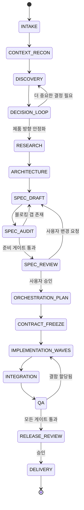

# Autonomous Product Discovery-to-Delivery Protocol

> **버전**: 1.0  
> **작성일**: 2026-07-25  
> **작성자**: Junghyun  
> **소스**: [src-006](../sources/src-006-autonomous-product-discovery-delivery-protocol.md)

---

## 정의

**Autonomous Product Discovery-to-Delivery Protocol**은 짧은 제품 아이디어(예: *"미니어처 건설 비디오 생성 서비스 만들고 싶어"*)를 **구조화된 제품 탐색 → 결정 중심 사용자 가이드 → 현재 기술 조사 → 아키텍처/기술 선택 → 구현 준비 사양 → 오케스트레이션 계획 → 위임 구현 → 통합·QA·배포**까지 자동화된 오케스트레이션으로 연결하는 **재사용 가능한 프로토콜**입니다.

이 프로토콜은 다음 두 역할을 동시에 수행하도록 설계되었습니다:

1. **인간이 읽을 수 있는 운영 매뉴얼**
2. **AI 오케스트레이터가 따를 수 있는 마스터 프롬프트**

모든 제품 유형(웹사이트, 애플리케이션, 자동화 시스템, API, AI 파이프라인, 내부 도구, 모바일 제품, 데이터 시스템, 콘텐츠 제작 시스템)에 **제품 불가지각(product-agnostic)**적으로 적용 가능합니다.

---

## 수학적/알고리즘적 기초

### 1. 워크플로 상태 머신 (Workflow State Machine)

프로토콜은 다음 상태 머신으로 실행됩니다:



**전역 예외 상태**: `PAUSED` | `BLOCKED` | `CANCELLED` | `SUPERSEDED`

### 2. 결정 분류 체계 (Decision Classification)

각 미지수는 5개 클래스로 분류:

| 클래스 | 동작 | 예시 |
|--------|------|------|
| `DISCOVER` | 묻지 않고 조사 | 저장소의 기존 프레임워크 |
| `DEFAULT` | 선택 + 되돌릴 수 있는 기본값 기록 | 포맷팅 라이브러리 |
| `RECOMMEND` | 옵션 + 추천 제시 | SPA vs 서버 렌더링 |
| `MANDATORY` | 사용자 필수 결정 | 유료 서비스, 공개 배포, 파괴적 마이그레이션 |
| `DEFER` | 현재 범위 밖으로 명시적 이동 | 향후 엔터프라이즈 SSO |

**자동 해결 규칙**: 다음 모두 충족 시 자동 해결
- 결정이 되돌릴 수 있음 (reversible)
- 한 옵션이 기존 프로젝트 관례에 명백히 부합
- 영향이 지역적 (local)
- 의미 있는 사용자 선호 내포되지 않음
- 가정이 기록됨

### 3. 기술 스택 가중 평가 수식 (Weighted Stack Evaluation)

각 후보 스택을 1~5로 채점 후 가중 합산:

```text
Score = sum(score_i × weight_i) / sum(weights)

차원별 기본 가중치:
- 필수 UX 적합성:        20
- 기존 작업공간 적합성:   15
- 납기 속도:              15
- 운영 단순성:            10
- 보안:                  10
- 테스트 용이성:          10
- 유지보수성:            10
- 비용:                   5
- 생태계 성숙도:          5
```

### 4. 사양 준비도 점수 (Specification Readiness Score)

| 영역 | 가중치 | 최소 점수 |
|------|--------|-----------|
| 제품 및 범위 | 15 | 80% |
| 사용자 여정 및 UX | 10 | 80% |
| 기능 요구사항 | 15 | 80% |
| 아키텍처 및 도메인 | 15 | 80% |
| 데이터, 보안, 프라이버시 | 10 | 80% |
| 통합 및 운영 | 10 | 80% |
| 오류 및 복구 | 5 | 80% |
| 테스팅 및 승인 | 10 | 80% |
| 마이그레이션 및 호환성 | 5 | 80% |
| 오케스트레이션 준비도 | 5 | 80% |

**통과 조건**: 총점 ≥ 95/100, 전 영역 ≥ 80%, 필수 결정 미해결 0개, 보안 블로커 0개

### 5. 파이프라인 상태 레코드 스키마 (Pipeline State Record)

```yaml
protocol_version: "1.0"
run_id: "uuid"
mode: "ASSISTED_AUTONOMOUS"
state: "DISCOVERY"
project_name: ""
workspace: ""
idea: ""
current_spec_revision: ""
contract_revision: ""
active_decision_id: ""
open_blockers: []
assumptions: []
decisions: []
research_records: []
task_graph_revision: ""
active_tasks: []
completed_tasks: []
failed_tasks: []
last_updated_at: ""
```

---

## 주요 변형/확장

| 변형 | 설명 |
|------|------|
| **Level 1: Master Prompt** | 이 Markdown을 단일 AI 태스크에서 마스터 프롬프트로 직접 사용 |
| **Level 2: Codex/Agent Skill** | 프로토콜에서 스킬 생성 → 반복 호출, 상태 규칙, 도구 정책 내장 |
| **Level 3: Skill + Task Management** | 자동 태스크 생성/대기/통합/리포팅까지 지원 |

> Markdown은 스킬/플러그인 생성 후에도 **진실의 원천(source of truth)으로 유지**되어야 함

---

## 실무 적용 고려사항

### 운영 모드 선택 가이드

| 상황 | 권장 모드 | 이유 |
|------|-----------|------|
| 탐색적 아이디어, 요구사항 불확실 | `ASSISTED_AUTONOMOUS` | 사용자 노력 최소화 + 고위험 결정 보호 |
| 내부 도구, 저위험, 반복 가능 | `FULL_AUTONOMOUS` | 완전 자동화로 속도 극대화 |
| 아키텍처 검토만 필요, 구현은 팀이 | `ADVISORY` | 오케스트레이터가 계획만 제공 |

### 필수 결정 트리거 체크리스트 (Mandatory Decision Triggers)

다음 중 하나라도 해당 시 **반드시 사용자 결정 대기**:

- [ ] 실질적인 반복 비용 발생
- [ ] 데이터를 외부 발행/전송
- [ ] 프라이버시 또는 컴플라이언스 영향
- [ ] 프로덕션 데이터 파괴/마이그레이션
- [ ] 공개 배포 생성
- [ ] 인증/인가 변경
- [ ] 실질적으로 다른 제품 결과 선택
- [ ] 저렴하게 되돌릴 수 없음

### 핫스팟 파일 단일 소유권 (Hotspot Ownership)

병렬 구현 시 다음 파일은 **단일 소유자** 배정 (동시 편집 금지):

- 애플리케이션 진입점
- 중앙 파이프라인
- 루트 스키마
- 공유 상태 저장소
- 의존성 매니페스트
- 주 UI 통합 파일

워커는 핫스팟 파일을 동시 편집하는 대신 **변경 요청**해야 함

---

## 관련 개념

- [[Specification-Driven Development]] — 사양 우선 개발 패러다임
- [[AI-Orchestrated Development]] — AI가 기획부터 배포까지 오케스트레이션
- [[Contract-First Development]] — 계약 동결 후 병렬 구현
- [[Decision-Driven Architecture]] — 결정 기록을 아키텍처 기반으로
- [[Specification Readiness Gate]] — 구현 전 품질 게이트

---

## 참조 소스

- [src-006](../sources/src-006-autonomous-product-discovery-delivery-protocol.md) — 원본 프로토콜 문서 전체

---

## 변경 이력

- 2026-07-25: 초기 생성 (src-006 ingest 완료)