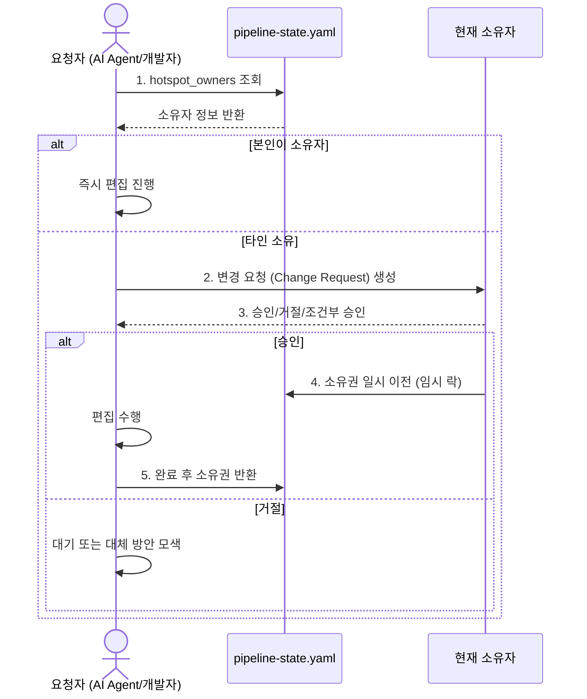

# Protocol Hotspot Ownership

> **소스**: [src-001](../sources/src-001-autonomous-product-discovery-delivery-protocol.md)  
> **상위 개념**: [[Autonomous Product Discovery-to-Delivery Protocol]]  
> **상태 레코드 필드**: `hotspot_owners` (pipeline-state.yaml)  
> **적용 시점**: `CONTRACT_FREEZE` 이후 모든 단계

---

## 핫스팟 파일 정의 (6개)

핫스팟 = **동시 편집 시 충돌/불일치 비용이 극도로 높은 파일**들입니다. 이 파일들은 프로토콜 실행 중 **단일 소유자(single owner)**만 수정할 수 있습니다.

| # | 파일 경로 (상대) | 설명 | 변경 빈도 | 충돌 시 영향도 |
|---|------------------|------|-----------|----------------|
| **1** | `pipeline-state.yaml` | 전체 파이프라인 상태 레코드 (단일 진실 원천) | 매 단계마다 | **Critical** — 전체 상태 불일치, 복구 불가능 |
| **2** | `contracts/api-schema.yaml` | API 계약 (OpenAPI/tRPC) | `CONTRACT_FREEZE` 시 1회, 이후 변경 금지 | **Critical** — 프론트/백엔드/모바일 전체 깨짐 |
| **3** | `contracts/event-schemas/` | 이벤트 스키마 디렉토리 (Avro/Protobuf/JSON Schema) | `CONTRACT_FREEZE` 시 1회 | **Critical** — 비동기 통신 파이프라인 단절 |
| **4** | `contracts/shared-types/` | 공유 타입 패키지 (TypeScript/Zod/Valibot) | `CONTRACT_FREEZE` 시 1회 | **Critical** — 타입 불일치로 빌드/런타임 실패 |
| **5** | `architecture/adr/` | 아키텍처 결정 기록 (ADR) - append-only | `ARCHITECTURE` 단계, 이후 추가만 | **High** — 결정 기록 누락/중복, 추적 불가 |
| **6** | `orchestration/plan.yaml` | 오케스트레이션 계획 (웨이브, 태스크, 의존성 그래프) | `ORCHESTRATION_PLAN` 단계 1회 | **High** — 실행 순서/병렬성 꼬임, 리소스 충돌 |

---

## 단일 소유권 규칙 (Single Ownership Rules)

### 1. 소유자 지정 (Assignment)

| 시점 | 지정 주체 | 기록 위치 |
|------|-----------|-----------|
| `CONTRACT_FREEZE` 진입 시 | 오케스트레이터 | `pipeline-state.yaml` > `hotspot_owners` |
| 신규 핫스팟 발생 시 | 즉시 오케스트레이터 | 동일 위치, 즉시 갱신 |

**소유자 자격**: 해당 파일의 의미를 이해하고 변경을 승인할 수 있는 **단일 엔티티** (사람 또는 AI 에이전트)

### 2. 소유자 기록 스키마 (pipeline-state.yaml)

```yaml
hotspot_owners:
  pipeline-state.yaml:
    owner: "orchestrator"
    assigned_at: "2026-07-25T12:00:00Z"
    contact: "orchestrator@system"
  contracts/api-schema.yaml:
    owner: "backend-lead"
    assigned_at: "2026-07-25T12:05:00Z"
    contact: "backend-lead@company.com"
  contracts/event-schemas/:
    owner: "platform-team"
    assigned_at: "2026-07-25T12:05:00Z"
    contact: "platform@company.com"
  contracts/shared-types/:
    owner: "frontend-lead"
    assigned_at: "2026-07-25T12:05:00Z"
    contact: "frontend-lead@company.com"
  architecture/adr/:
    owner: "architect"
    assigned_at: "2026-07-25T12:10:00Z"
    contact: "architect@company.com"
  orchestration/plan.yaml:
    owner: "orchestrator"
    assigned_at: "2026-07-25T12:00:00Z"
    contact: "orchestrator@system"
```

---

## 동시 편집 금지 및 락 프로세스 (Concurrency Control)

### 잠금 획득 (Lock Acquisition)



### 변경 요청 (Change Request) 포맷

```yaml
# .change-requests/cr-20260725-001.yaml
change_request_id: "cr-20260725-001"
timestamp: "2026-07-25T14:30:00Z"
requester: "frontend-agent"
target_file: "contracts/shared-types/user.ts"
current_owner: "frontend-lead"
reason: "User 타입에 avatar_url 필드 추가 (프로필 이미지 표시 필요)"
proposed_diff: |
  --- a/contracts/shared-types/user.ts
  +++ b/contracts/shared-types/user.ts
  @@ -10,6 +10,7 @@
   export interface User {
     id: string;
     email: string;
     name: string;
  +  avatar_url?: string;
   }
status: "PENDING"  # PENDING | APPROVED | REJECTED | EXPIRED
reviewed_by: null
reviewed_at: null
conditions: []
expires_at: "2026-07-25T18:30:00Z"  # 4시간 후 만료
```

### 승인 시 소유권 일시 이전

```yaml
# pipeline-state.yaml (일시적 변경)
hotspot_owners:
  contracts/shared-types/user.ts:
    owner: "frontend-agent"           # 임시 소유자
    assigned_at: "2026-07-25T14:35:00Z"
    contact: "frontend-agent@system"
    temporary: true
    original_owner: "frontend-lead"
    lock_expires_at: "2026-07-25T18:30:00Z"
    change_request_id: "cr-20260725-001"
```

### 편집 완료 및 반환

편집 완료 후:
1. 변경 사항 커밋/푸시
2. `change_request` 상태 → `APPROVED` → `COMPLETED`
3. `hotspot_owners` 원소유자로 복원
4. `temporary: false`, `lock_expires_at` 제거

---

## 예외 처리 (Exceptions)

| 상황 | 처리 |
|------|------|
| **소유자 부재** (휴가, 퇴사, AI 에이전트 다운) | 오케스트레이터가 차선 소유자 지정 (`reassign` 액션) |
| **긴급 핫픽스** (프로덕션 장애) | `EMERGENCY` 플래그로 즉시 락 획득, 사후 승인 (24시간 내) |
| **소유자 무응답** (4시간 초과) | 자동 에스컬레이션 → 오케스트레이터가 승인/거절 대행 |
| **동일 파일 다중 변경 요청** | 선착순 큐잉, 이전 요청 완료 후 다음 처리 |

---

## 위반 시 페널티 (Violation Consequences)

| 위반 유형 | 감지 시점 | 대응 |
|-----------|-----------|------|
| 소유권 없이 핫스팟 파일 수정 시도 | CI/Pre-commit 훅 | **커밋 차단**, 에러 메시지로 소유자/변경요청 절차 안내 |
| 변경 요청 없이 직접 푸시 | CI (브랜치 보호 규칙) | **Push 거부**, `change_request` 생성 강제 |
| 락 만료 후 미반환 | 주기적 스케줄러 (1시간마다) | 강제 소유권 회수, 알림 발송 |
| 변경 요청 승인 후 미작업 (24시간) | 스케줄러 | 자동 취소, 원소유자 복원 |

---

## 관련 개념

- [[Autonomous Product Discovery-to-Delivery Protocol]] — 상위 프로토콜 개요
- [[Protocol Pipeline State Record]] — `hotspot_owners` 필드 정의 및 저장 위치
- [[Protocol Workflow State Machine]] — `CONTRACT_FREEZE` 이후 단계에서 본 규칙 강제 적용
- [[Protocol Operation Modes]] — `FULL_AUTONOMOUS` 모드에서는 오케스트레이터가 자동으로 변경요청 생성/승인 가능

---

## 참조 소스

- [src-001](../sources/src-001-autonomous-product-discovery-delivery-protocol.md) — §7. 핫스팟 단일 소유권

---

## 변경 이력

- 2026-07-25: src-001에서 분해 생성