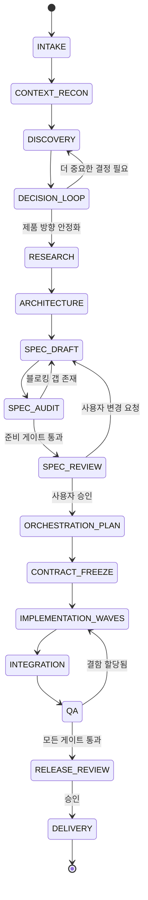

# Protocol Workflow State Machine

> **소스**: [src-001](../sources/src-001-autonomous-product-discovery-delivery-protocol.md)  
> **상위 개념**: [[Autonomous Product Discovery-to-Delivery Protocol]]

---

## 상태 머신 정의

프로토콜은 다음 8단계 상태 머신으로 실행됩니다:

---

## 8단계 상세

| 단계 | 상태 코드 | 목적 | 진입 조건 | 산출물 | 다음 단계 |
|------|-----------|------|-----------|--------|-----------|
| 1 | `INTAKE` | 아이디어 수집·정규화 | 사용자 입력 | 정제된 아이디어 문장 | `CONTEXT_RECON` |
| 2 | `CONTEXT_RECON` | 기존 작업공간/코드베이스 조사 | 아이디어 확정 | 컨텍스트 리포트 (기술 스택, 제약, 기존 패턴) | `DISCOVERY` |
| 3 | `DISCOVERY` | 제품 탐색·범위 확정 | 컨텍스트 완료 | 제품 비전, 핵심 사용자 여정, MVP 범위 | `DECISION_LOOP` |
| 4 | `DECISION_LOOP` | 미해결 결정 식별·분류·해결 | 탐색 완료 | 결정 레지스터 (분류+해결 상태) | `DISCOVERY` 또는 `RESEARCH` |
| 5 | `RESEARCH` | 기술 조사·대안 비교 | 결정 루프에서 연구 필요 판단 | 리서치 레코드 (옵션, 장단점, 근거) | `ARCHITECTURE` |
| 6 | `ARCHITECTURE` | 아키텍처·기술 스택 선정 | 연구 완료 | 아키텍처 결정 기록 (ADR), 스택 선택 근거 | `SPEC_DRAFT` |
| 7 | `SPEC_DRAFT` | 구현 준비 사양 초안 작성 | 아키텍처 확정 | 사양 문서 v0.x (기능, API, 데이터, UI, 테스트) | `SPEC_AUDIT` |
| 8 | `SPEC_AUDIT` | 사양 품질 게이트 (준비도 점수) | 사양 초안 완료 | 감사 리포트, 블로킹 갭 리스트 | `SPEC_DRAFT`(갭) 또는 `SPEC_REVIEW`(통과) |
| 9 | `SPEC_REVIEW` | 사용자 사양 검토·승인 | 감사 통과 | 사용자 피드백, 승인/변경 요청 | `SPEC_DRAFT`(변경) 또는 `ORCHESTRATION_PLAN`(승인) |
| 10 | `ORCHESTRATION_PLAN` | 구현 파도·태스크 그래프 생성 | 사양 승인 | 오케스트레이션 계획, 태스크 분해, 의존성 그래프 | `CONTRACT_FREEZE` |
| 11 | `CONTRACT_FREEZE` | 인터페이스·데이터 계약 동결 | 계획 확정 | 계약 문서 (API 스키마, 이벤트, 공유 타입) | `IMPLEMENTATION_WAVES` |
| 12 | `IMPLEMENTATION_WAVES` | 병렬 구현 웨이브 실행 | 계약 동결 | 구현 아티팩트 (코드, 설정, 테스트) | `INTEGRATION` |
| 13 | `INTEGRATION` | 컴포넌트 통합·연결 | 웨이브 완료 | 통합 빌드, 연동 테스트 결과 | `QA` |
| 14 | `QA` | 품질 게이트·결함 관리 | 통합 완료 | QA 리포트, 결함 티켓, 릴리스 후보 | `IMPLEMENTATION_WAVES`(결함) 또는 `RELEASE_REVIEW` |
| 15 | `RELEASE_REVIEW` | 릴리스 준비도 검토 | QA 통과 | 릴리스 노트, 롤백 계획, 승인 요청 | `DELIVERY` |
| 16 | `DELIVERY` | 프로덕션 배포·모니터링 | 릴리스 승인 | 배포 아티팩트, 모니터링 대시보드 | `[*]` |

---

## 전역 예외 상태

| 상태 | 진입 조건 | 허용 전이 | 비고 |
|------|-----------|-----------|------|
| `PAUSED` | 사용자 일시정지 요청 | 원래 상태 | 모든 웨이브 중단, 상태 보존 |
| `BLOCKED` | 외부 의존성 차단 (권한, 인프라, 정책) | 차단 해제 시 원래 상태 | 블로커 기록 필수 |
| `CANCELLED` | 사용자 취소 / 비즈니스 이유 | 없음 (종료) | 산출물 아카이브 |
| `SUPERSEDED` | 상위 프로토콜 실행으로 대체 | 없음 (종료) | 새 run_id로 연결 |

---

## 상태 불변식 (Invariants)

1. **단방향 진행 원칙**: `DECISION_LOOP` ↔ `DISCOVERY`, `SPEC_AUDIT` ↔ `SPEC_DRAFT`, `QA` ↔ `IMPLEMENTATION_WAVES` 외에는 역전이 금지
2. **결정 완결성**: `DECISION_LOOP`에서 `MANDATORY` 클래스 결정이 미해결 상태로 `RESEARCH` 진입 금지
3. **계약 동결 후 변경 금지**: `CONTRACT_FREEZE` 이후 인터페이스 변경 시 새 리비전 필요 (새 run_id 권장)
4. **단일 활성 run_id**: 동일 워크스페이스에서 동시 실행되는 프로토콜 인스턴스는 1개만 허용

---

## 관련 개념

- [[Autonomous Product Discovery-to-Delivery Protocol]] — 상위 프로토콜 개요
- [[Protocol Decision Classification]] — DECISION_LOOP에서 사용하는 분류 체계
- [[Protocol Specification Readiness Gate]] — SPEC_AUDIT에서 사용하는 품질 게이트
- [[Protocol Pipeline State Record]] — 각 상태에서 기록/갱신되는 상태 레코드

---

## 참조 소스

- [src-001](../sources/src-001-autonomous-product-discovery-delivery-protocol.md) — §1. 워크플로 상태 머신

---

## 변경 이력

- 2026-07-25: src-001에서 분해 생성