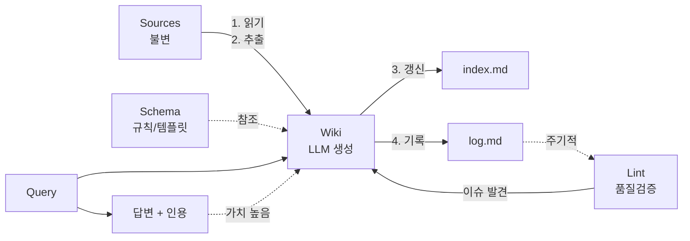

# 위키 구조 — 3계층 아키텍처 상세

Andrej Karpathy의 **LLM Wiki** 패턴을 구현한 3계층 아키텍처입니다.

---

## 설계 철학

### 문제의식
- **지식의 반감기 단축**: LLM 분야는 주간 단위로 새로운 논문/모델/기법 등장
- **단일 진실원천 부재**: 동일 주제에 대한 상충하는 주장이 블로그, 논문, 트윗에 산재
- **LLM 단독 운영 한계**: 환각, 최신성 부재, 추적 불가 → 사람이 규칙 설계, LLM이 실행

### 해결책: 3계층 분리

| 계층 | 변경 빈도 | 작성자 | 저장 형식 |
|------|-----------|--------|-----------|
| **Sources** | 낮음 (수집 시점만) | 사람 | 원본 + 메타데이터 (불변) |
| **Wiki** | 높음 (주간/일간) | LLM | 구조화된 마크다운 (가변) |
| **Schema** | 매우 낮음 (분기/반기) | 사람 + LLM 협의 | 마크다운 + 템플릿 (규칙) |

---

## 계층별 상세

### 1️⃣ Sources — 원본 소스 아카이브 (불변)

**경로**: `src/content/docs/ko/sources/`

#### 역할
- LLM이 **읽기만 하고 쓰지 않는** 원본 자료 보관소
- 모든 위키 주장의 **최종 근거** 제공
- 저작권 허용 범위 내 원문/요약/핵심 발췌 저장

#### 파일 구조
```
sources/
├── src-001-attention-is-all-you-need.md
├── src-002-gpt-4-technical-report.md
└── src-003-rag-paper.md
```

#### 메타데이터 스키마 (필수)
```yaml
---
source_id: 'src-001'
title: 'Attention Is All You Need'
authors: ['Vaswani et al.']
venue: 'NeurIPS 2017'
year: 2017
url: 'https://arxiv.org/abs/1706.03762'
type: 'paper'  # paper | article | blog | video | code | doc
tags: ['foundational', 'attention', 'transformer']
ingested_at: '2025-07-01'
ingested_by: 'claude'
content_hash: 'sha256:abc123...'  # 중복 방지
---
```

#### 콘텐츠 구성
| 소스 유형 | 포함 내용 |
|-----------|-----------|
| **논문** | 초록, 핵심 그림/표 설명, 주요 수식, 한계점, 인용문 |
| **블로그/아티클** | 요약, 핵심 주장, 데이터 포인트, 원본 링크 |
| **코드/문서** | 주요 API, 설정 예시, 아키텍처 노트 |

> **원칙**: 원본 텍스트 전체 저장 권장 (저작권 허용 시). 요약본과 함께 보관.

---

### 2️⃣ Wiki — 위키 페이지 (LLM 관리)

**경로**: `src/content/docs/ko/wiki/`

4가지 페이지 유형으로 구성. **각 페이지는 단일 책임** (한 엔티티/개념/주제).

#### 디렉토리 구조
```
wiki/
├── entities/      # 핵심 대상 객체
├── concepts/      # 핵심 원리/메커니즘
├── synthesis/     # 다중 소스 종합 분석
└── comparisons/   # 정량/정성 비교표
```

#### 4가지 페이지 유형 상세

| 유형 | 설명 | 예시 | 템플릿 |
|------|------|------|--------|
| **Entity** | 모델, 논문, 도구, 인물, 조직 | GPT-4, PyTorch, Yann LeCun, OpenAI | `entity.md` |
| **Concept** | 알고리즘, 메커니즘, 원리 | Attention, RAG, MoE, LoRA | `concept.md` |
| **Synthesis** | 시계열 진화, 베스트 프랙티스, 논쟁 정리 | LLM 진화사, Fine-tuning 가이드 | `synthesis.md` |
| **Comparison** | 스펙 비교, 트레이드오프, 벤치마크 | 모델 스펙표, RAG vs Fine-tuning | `comparison.md` |

#### 공통 프론트매터
```yaml
---
title: '페이지 제목'
description: '한 줄 요약 (160자 이하)'
type: 'entity | concept | synthesis | comparison'
entity_type: 'model | paper | tool | person | organization'  # entity만
sources: ['src-001', 'src-003']  # 근거 소스 ID
tags: ['tag1', 'tag2']  # 자유 태그
last_updated: 'YYYY-MM-DD'  # LLM 최종 갱신일
confidence: 'high | medium | low'  # 정보 신뢰도
---
```

#### 관계 표현 (필수)
```markdown
## 관련 엔티티/개념
- [[GPT-4]] — GPT-3.5 후속 모델, 멀티모달 지원
- [[Attention Mechanism]] — 핵심 아키텍처 구성요소
- [[OpenAI]] — 개발 조직
```

---

### 3️⃣ Schema — 공유 규칙 (사람 + LLM)

**경로**: `src/content/docs/ko/schema/`

#### 구성
```
schema/
├── CLAUDE.md          # 운영 계약서 (이 문서의 상위 버전)
├── templates/         # 페이지 템플릿 4종 (con텐츠 컬렉션 밖)
│   ├── entity.md
│   ├── concept.md
│   ├── synthesis.md
│   └── comparison.md
└── prompts/           # 재사용 프롬프트
    ├── ingest.md
    ├── query.md
    └── lint.md
```

#### CLAUDE.md 핵심 내용
1. **프론트매터 표준** — 4 유형별 필수/선택 필드
2. **템플릿 4종** — 페이지 생성 시 따를 구조
3. **워크플로 3종** — Ingest/Query/Lint 단계별 절차
4. **네이밍/링크 컨벤션** — 파일명, 내부 링크, 태그 규칙
5. **품질 기준** — 단일 진실원천, 추적가능성, 최신성, 모순금지, 원자성, 교차참조
6. **스키마 진화 프로세스** — 변경 제안 → 영향 분석 → 합의 → 적용 → 로그

---

## 특수 파일 (루트 레벨)

### index.md — 콘텐츠 카탈로그
- **목적**: 전체 콘텐츠 네비게이션 허브
- **갱신**: 모든 ingest 후 필수
- **구조**: 카테고리별 표 (페이지, 요약, 소스 수, 최종 갱신일)
- **정렬**: `last_updated` 내림차순

### log.md — 연대기 작업 로그
- **목적**: 모든 변경 이력 추적, 파싱 가능
- **형식**: `## [YYYY-MM-DD] type | 설명`
- **타입**: `ingest | query | lint | schema | maintenance`
- **상세**: 영향받은 페이지, 소스 ID, 주요 변경사항

---

## 데이터 플로우



---

## 관리 주체 분리 원칙

| 작업 | Sources | Wiki | Schema |
|------|---------|------|--------|
| **생성** | 사람 | LLM | 사람 + LLM 협의 |
| **수정** | ❌ 금지 | LLM | 사람 승인 후 LLM 적용 |
| **삭제** | ❌ 금지 | LLM (플래그 후 사람 확인) | 사람만 |
| **검증** | 해시 검증 | Lint 워크플로 | 사람 리뷰 |

---

## 디렉토리 깊이 제한

> **최대 3단계** (사용자 요청)
```
ko/
├── wiki/
│   ├── entities/           # 2단계
│   │   └── gpt-4.md       # 3단계 (최대)
│   ├── concepts/
│   │   └── rag.md
│   ├── synthesis/
│   └── comparisons/
```

`wiki/entities/openai/gpt-4.md` 같은 4단계 금지 → `wiki/entities/openai-gpt-4.md`로 평탄화

---

## 품질 기준 (CLAUDE.md §8 요약)

| 기준 | 설명 | 검증 시점 |
|------|------|-----------|
| **단일 진실원천** | 동일 사실은 한 페이지에만. 중복 시 합성 페이지로 통합 | Lint 시 |
| **추적가능성** | 모든 주장은 `sources` 배열로 소스 연결 | Ingest 시 |
| **최신성** | `last_updated` 6개월 초과 시 lint 플래그 | Lint 시 |
| **모순 금지** | 상충 주장 발견 시 즉시 플래그, 비교 페이지에서 논의 | Ingest/Lint 시 |
| **원자성** | 한 페이지 = 한 엔티티/개념/주제. 과대 시 분할 | 작성 시 |
| **교차참조** | 관련 개념/엔티티 간 양방향 링크 필수 | 작성 시 |

---

*이 문서는 `schema/CLAUDE.md`의 요약본입니다. 전체 운영 규칙은 CLAUDE.md를 참조하세요.*